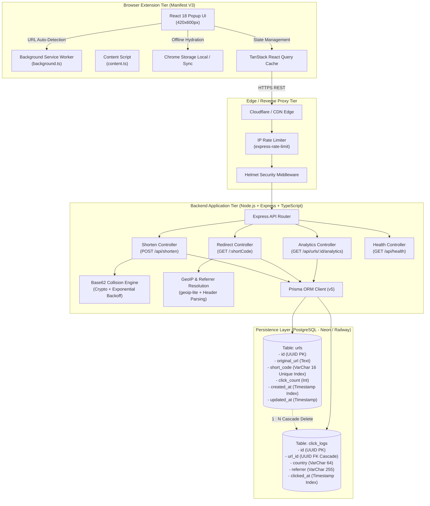

# LinkLite — Technical Architecture & Engineering Design

LinkLite is a high-performance, production-grade URL shortening and link management SaaS with a Manifest V3 browser extension and a TypeScript/Express/PostgreSQL backend.

---

## 1. System Architecture Diagram



---

## 2. Data Flow Specifications

### 2.1 Shortening Flow (`POST /api/shorten`)
1. **Request Intake**: Client sends `{ "url": "https://example.com/target", "customAlias": "optional" }`.
2. **Sanitization & Validation**:
   - URL normalized (ensures `http://` or `https://`).
   - Length capped at 2048 characters.
   - Scheme restricted to standard web protocols (blocks `javascript:`, `file:`, `data:`).
3. **Short Code Generation & Collision Handling**:
   - If custom alias provided, validates format (`[a-zA-Z0-9_-]{6,8}`) and verifies it is not a reserved route (`/api`, `/health`, etc.).
   - If auto-generated, uses `crypto.randomBytes` to generate 6-character Base62 string (`62^6 = 56.8 billion combinations`).
   - If a collision occurs (`Prisma P2002` error), exponential retry increments attempts and increases length up to 8 characters (`62^8 = 218 trillion combinations`).
4. **Persistence**: Record written to `urls` table.
5. **Response**: HTTP 201 with full short URL payload.

### 2.2 Fast Redirect & Async Analytics Flow (`GET /:shortCode`)
1. **Lookup**: Direct index lookup on `urls.short_code`.
2. **Metadata Extraction**:
   - **Country**: Extracted in order from `CF-IPCountry` → `CloudFront-Viewer-Country` → `geoip-lite` IP database lookup → fallback to `'Unknown'`.
   - **Referrer**: Extracted from `Referer` HTTP header, parsed to root domain (e.g., `twitter.com`, `github.com`) or labeled `'Direct'`.
3. **Non-Blocking Analytics Write**:
   - Dispatches asynchronous `prisma.$transaction` creating `click_logs` entry and atomically incrementing `urls.click_count`.
4. **Immediate Redirect**:
   - Sets headers: `Cache-Control: no-cache, no-store, must-revalidate`.
   - Returns HTTP 302 Found redirecting visitor to `original_url`.

---

## 3. Database Schema Design

### 3.1 Entity Relationship Details

```
+-------------------------------------------------------------+
|                           urls                              |
+-------------------------------------------------------------+
| id            : UUID (Primary Key)                          |
| original_url  : TEXT (Not Null)                             |
| short_code    : VARCHAR(16) (Unique Index, Not Null)        |
| click_count   : INTEGER (Default: 0, Not Null)              |
| created_at    : TIMESTAMP WITH TIME ZONE (Default: now())   |
| updated_at    : TIMESTAMP WITH TIME ZONE (Updated at now()) |
+-------------------------------------------------------------+
                              |
                              | 1 : N (On Delete Cascade)
                              v
+-------------------------------------------------------------+
|                        click_logs                           |
+-------------------------------------------------------------+
| id            : UUID (Primary Key)                          |
| url_id        : UUID (Foreign Key -> urls.id)               |
| country       : VARCHAR(64) (Nullable)                      |
| referrer      : VARCHAR(255) (Nullable)                     |
| clicked_at    : TIMESTAMP WITH TIME ZONE (Default: now())   |
+-------------------------------------------------------------+
```

### 3.2 Indexing Strategy
- `urls(short_code)`: B-tree unique index for sub-millisecond redirect lookups ($O(\log N)$).
- `urls(created_at DESC)`: B-tree index for fast paginated recent links listing.
- `click_logs(url_id)`: Foreign key index for fast aggregate analytics joins.
- `click_logs(clicked_at DESC)`: Time-series index for chronological click stream analysis.

---

## 4. Security & Hardening Architecture

1. **Helmet Protection**: Adds `X-Content-Type-Options: nosniff`, `X-Frame-Options: SAMEORIGIN`, and strict referrer policy.
2. **Rate Limiting**:
   - Global API limiter: 100 requests per 15 minutes per IP.
   - Shorten limiter: 30 requests per minute per IP to prevent spam link farms.
3. **Input Sanitization**: Strict Zod schema validation on body, query, and path parameters.
4. **Error Masking**: Production errors do not leak database stack traces or internal connection strings.
